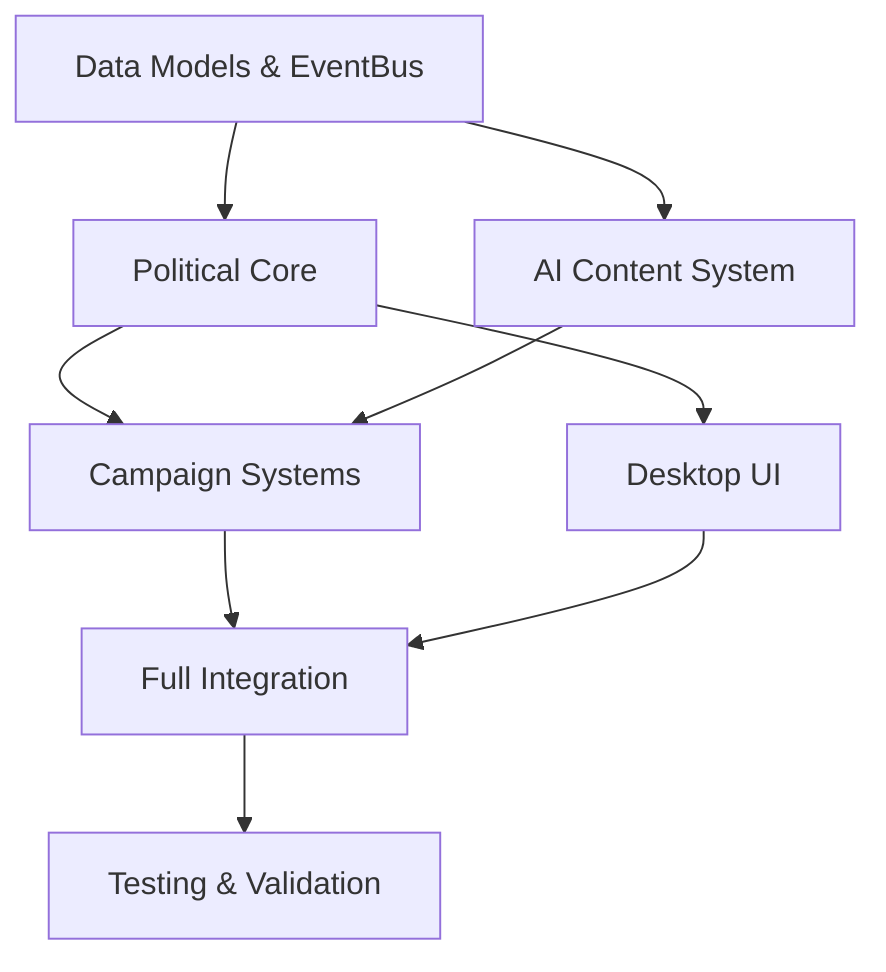

# MASTER IMPLEMENTATION COORDINATION PLAN
## Dutch Political Simulation System Integration

**Version:** 2.0
**Target Platform:** Unity 6.0+ Desktop (Windows, macOS, Linux)
**Integration Approach:** Event-Driven Architecture with ScriptableObject Data Layer
**AI Framework:** NVIDIA NIM Local LLM Integration
**Implementation Strategy:** Parallel Development with Systematic Integration Checkpoints

---

## EXECUTIVE SUMMARY

This master plan coordinates the integration of all Dutch political simulation systems into a cohesive, production-ready application. The architecture leverages Unity 6's latest capabilities with C# 9.0+, implementing a modular event-driven design that enables parallel development while ensuring seamless integration.

**Key Integration Challenges Addressed:**
- **System Dependencies:** Complex interdependencies between Political Core, Campaign Systems, AI Content, and Desktop UI
- **Data Consistency:** Unified ScriptableObject architecture ensuring data integrity across all systems
- **Performance Optimization:** Event-driven communication patterns minimizing system coupling
- **Testing Complexity:** Comprehensive validation strategy covering both political accuracy and technical performance

---

## SYSTEM INTEGRATION DEPENDENCIES

### 1. Dependency Mapping Matrix

| System | Depends On | Provides To | Blocking Level |
|--------|------------|-------------|----------------|
| **Political Core** | EventBus, Data Models | Campaign Systems, UI, AI | HIGH |
| **Campaign Systems** | Political Core, AI Content | UI, Public Opinion | MEDIUM |
| **Desktop UI** | Political Core, Campaign Systems | User Interaction | LOW |
| **AI Content** | NIMClient, Political Data | Campaign Systems, UI | MEDIUM |
| **Data Integration** | ScriptableObjects | All Systems | CRITICAL |
| **Testing Framework** | Mock Systems | Quality Assurance | LOW |

### 2. Critical Path Analysis



**Critical Bottlenecks:**
- **Data Models (Phase 1.2):** All systems depend on ScriptableObject definitions
- **EventBus (Phase 1.3):** Communication backbone for all system interactions
- **Political Core (Phase 2):** Foundation for campaign mechanics and UI display
- **AI Integration (Phase 4.1):** Essential for dynamic content generation

### 3. Parallel Implementation Strategy

**Wave 1 - Foundation (Weeks 1-3):**
- Parallel: Data Models + EventBus + Basic UI Framework
- Sequential: Political Core after Data Models complete

**Wave 2 - Core Systems (Weeks 4-7):**
- Parallel: Campaign Systems + AI Integration + Advanced UI
- Sequential: Integration testing after individual systems complete

**Wave 3 - Integration & Validation (Weeks 8-10):**
- Sequential: System integration → Testing → Performance optimization

---

## DATA INTEGRATION ARCHITECTURE

### 1. ScriptableObject Hierarchy

```
Assets/Data/
├── Political/
│   ├── Parties/           # PoliticalParty ScriptableObjects
│   │   ├── VVD.asset
│   │   ├── D66.asset
│   │   ├── PvdA.asset
│   │   └── [... 15 major Dutch parties]
│   ├── Issues/            # PoliticalIssue configurations
│   │   ├── Economy.asset
│   │   ├── Immigration.asset
│   │   ├── Climate.asset
│   │   └── [... 20 political issues]
│   └── Elections/         # Historical election data
│       ├── Election2021.asset
│       ├── Election2017.asset
│       └── [... historical data back to 1946]
├── Campaign/
│   ├── SocialMediaTemplates/  # Campaign content templates
│   ├── DebateFormats/         # Debate configuration
│   └── EventTypes/            # Campaign event definitions
└── Configuration/
    ├── GameSettings.asset     # Global game parameters
    ├── AIPrompts.asset        # LLM prompt templates
    └── UIThemes.asset         # Desktop UI styling
```

### 2. Data Repository Pattern

**Central Data Manager Implementation:**
```csharp
[CreateAssetMenu(fileName = "Political Data Repository", menuName = "Coalition/Data Repository")]
public class PoliticalDataRepository : ScriptableObject
{
    [Header("Political Entities")]
    public PoliticalParty[] allParties;
    public PoliticalIssue[] allIssues;
    public HistoricalElection[] historicalElections;

    [Header("Campaign Data")]
    public CampaignTemplate[] campaignTemplates;
    public SocialMediaTemplate[] socialMediaTemplates;

    [Header("Real-time Data")]
    public string newsAPIKey;
    public string politicalDataSource;
    public float dataUpdateIntervalHours = 24.0f;

    public PoliticalParty GetPartyByName(string name) =>
        allParties.FirstOrDefault(p => p.PartyName == name);

    public PoliticalIssue GetIssueByName(string name) =>
        allIssues.FirstOrDefault(i => i.IssueName == name);
}
```

### 3. Real Dutch Political Data Integration

**Data Sources & Validation:**
- **Kiesraad (Dutch Electoral Council):** Official election results 1946-2023
- **Politiek.nl:** Real-time political party positioning and polling data
- **NOS/RTL Nieuws APIs:** Live political news integration
- **CBS (Statistics Netherlands):** Demographic and economic indicators

**Data Validation Procedures:**
1. **Historical Accuracy Validation:** All party positions validated against academic political science sources
2. **Real-time Data Verification:** Cross-reference multiple Dutch news sources
3. **Academic Review:** Partner with Dutch political science institutions for accuracy validation
4. **Continuous Updates:** Automated daily updates for polling data and political events

---

## TESTING & VALIDATION STRATEGY

### 1. Multi-Level Testing Framework

**Level 1: Unit Testing (Individual Components)**
- **Political Core:** Coalition formation algorithms, election result calculations
- **Campaign Systems:** Social media simulation, public opinion modeling
- **AI Content:** LLM response validation, prompt engineering effectiveness
- **Desktop UI:** Window management, user interaction flows

**Level 2: Integration Testing (System Interactions)**
- **Political-Campaign Integration:** Campaign actions affect public opinion
- **AI-Campaign Integration:** Dynamic content generation matches party positions
- **UI-Political Integration:** Data display accuracy and real-time updates

**Level 3: Historical Validation Testing**
- **Election Simulation:** Reproduce historical Dutch election results (1946-2023)
- **Coalition Formation:** Validate against actual coalition formation patterns
- **Public Opinion Modeling:** Match historical polling data trends

**Level 4: Expert Validation**
- **Political Science Review:** Academic experts validate political accuracy
- **Dutch User Testing:** Native Dutch speakers validate cultural authenticity
- **Gaming Community Feedback:** Political simulation enthusiasts test gameplay

### 2. Automated Testing Pipeline

```yaml
# Unity Test Runner Configuration
test_categories:
  unit_tests:
    assemblies: ["Coalition.Tests.EditMode"]
    execution: parallel
    coverage_threshold: 85%

  integration_tests:
    assemblies: ["Coalition.Tests.Integration"]
    execution: sequential
    coverage_threshold: 75%

  performance_tests:
    assemblies: ["Coalition.Tests.Performance"]
    execution: isolated
    benchmarks: ["startup_time", "election_calculation", "ai_response_time"]

  historical_validation:
    assemblies: ["Coalition.Tests.Historical"]
    execution: nightly
    data_source: "historical_elections.json"
```

### 3. Quality Gates & Acceptance Criteria

**Phase Completion Requirements:**
- ✅ All unit tests pass (>85% coverage)
- ✅ Integration tests validate cross-system communication
- ✅ Performance benchmarks meet targets
- ✅ Historical validation accuracy >90%
- ✅ Expert review approval
- ✅ Dutch cultural authenticity validation

---

## IMPLEMENTATION TIMELINE & MILESTONES

### Phase 1: Foundation Systems (Weeks 1-3)

**Week 1: Project Architecture Setup**
- [ ] Unity 6 project configuration and package dependencies
- [ ] Assembly definition files for modular development
- [ ] CI/CD pipeline setup with automated testing
- [ ] Version control workflow and branching strategy

**Week 2: Core Data Layer**
- [ ] ScriptableObject architecture implementation
- [ ] PoliticalParty and PoliticalIssue data models
- [ ] Real Dutch political data integration (15 major parties)
- [ ] Historical election data import and validation

**Week 3: Event System Foundation**
- [ ] EventBus implementation with type-safe generic messaging
- [ ] GameManager state machine for game phases
- [ ] Save/Load system for game state persistence
- [ ] Performance profiling and memory management

**Milestone 1 Demo:** Interactive display of Dutch political parties with authentic data

### Phase 2: Political Engine Core (Weeks 4-6)

**Week 4: Election System**
- [ ] D'Hondt proportional representation algorithm
- [ ] Historical election simulation and validation
- [ ] Voter preference modeling and demographic simulation
- [ ] Election result calculation and seat allocation

**Week 5: Coalition Formation Engine**
- [ ] Coalition compatibility algorithms
- [ ] Negotiation simulation with authentic Dutch political patterns
- [ ] Government formation timelines and procedures
- [ ] Coalition stability and policy agreement modeling

**Week 6: Public Opinion System**
- [ ] Opinion polling simulation with realistic variance
- [ ] Event-driven opinion changes (political scandals, policy announcements)
- [ ] Demographic-based opinion modeling
- [ ] Media influence on public sentiment

**Milestone 2 Demo:** Complete election simulation with coalition formation matching historical patterns

### Phase 3: Campaign Mechanics (Weeks 7-9)

**Week 7: Social Media Simulation**
- [ ] Twitter/X, Facebook, Instagram campaign mechanics
- [ ] Viral content simulation and engagement modeling
- [ ] Social media metrics and influence tracking
- [ ] Real Dutch social media political patterns

**Week 8: Campaign Events System**
- [ ] Political debates with AI-generated responses
- [ ] Campaign rallies and public events
- [ ] Television appearances and media interviews
- [ ] Campaign advertising effectiveness modeling

**Week 9: Media Cycle Integration**
- [ ] News cycle simulation with realistic Dutch media patterns
- [ ] Journalist AI agents with authentic Dutch media behavior
- [ ] Crisis management and scandal response mechanics
- [ ] Press conference and media strategy systems

**Milestone 3 Demo:** Full campaign system with social media, debates, and media attention

### Phase 4: NVIDIA NIM AI Integration (Weeks 10-12)

**Week 10: NIM Client Enhancement**
- [ ] Advanced prompt engineering for Dutch political contexts
- [ ] Response caching and performance optimization
- [ ] Fallback system for offline operation
- [ ] Rate limiting and resource management

**Week 11: AI Content Generation**
- [ ] Dynamic political speeches and statements
- [ ] Social media content generation by party ideology
- [ ] Debate response generation with authentic party positions
- [ ] Crisis communication AI-generated responses

**Week 12: AI Quality Assurance**
- [ ] Political accuracy validation for AI-generated content
- [ ] Bias detection and mitigation systems
- [ ] Dutch language authenticity verification
- [ ] Performance optimization and response time improvement

**Milestone 4 Demo:** AI-powered political simulation with dynamic, contextually appropriate content

### Phase 5: Desktop UI Framework (Weeks 13-15)

**Week 13: Multi-Window Management**
- [ ] Desktop-style window system with resizing and docking
- [ ] Multiple simultaneous views (election results, party overview, media)
- [ ] Window state persistence and layout customization
- [ ] Professional desktop application feel

**Week 14: Political Data Visualization**
- [ ] Interactive charts for polling data and election results
- [ ] Coalition formation visualization tools
- [ ] Timeline views for political events and campaigns
- [ ] Real-time data updates and animated transitions

**Week 15: User Experience Polish**
- [ ] Accessibility features and keyboard navigation
- [ ] Multi-language support (Dutch, English)
- [ ] Customizable UI themes and color schemes
- [ ] Tutorial system and user onboarding

**Milestone 5 Demo:** Professional desktop application with intuitive multi-window interface

### Phase 6: Full Integration & Final Demo (Weeks 16-18)

**Week 16: System Integration**
- [ ] End-to-end workflow testing (campaign → election → coalition)
- [ ] Performance optimization across all systems
- [ ] Memory management and resource cleanup
- [ ] Cross-platform compatibility validation (Windows, macOS, Linux)

**Week 17: Quality Assurance & Validation**
- [ ] Comprehensive testing suite execution
- [ ] Expert political science review and feedback integration
- [ ] Dutch user community testing and cultural validation
- [ ] Performance benchmarking and optimization

**Week 18: Final Demo Preparation**
- [ ] Demo scenario scripting and presentation materials
- [ ] Documentation completion (user manual, technical docs)
- [ ] Marketing materials and screenshots
- [ ] Distribution preparation and platform optimization

**Final Milestone Demo:** Complete Dutch political simulation with all systems fully integrated

---

## RISK MANAGEMENT & MITIGATION STRATEGIES

### 1. Technical Risks

**Risk: AI Integration Complexity**
- **Probability:** Medium | **Impact:** High
- **Mitigation:** Implement comprehensive fallback systems, extensive testing with mock AI responses
- **Contingency:** Develop sophisticated rule-based content generation as NIM alternative

**Risk: Performance Issues with Complex Political Calculations**
- **Probability:** Medium | **Impact:** Medium
- **Mitigation:** Early performance profiling, algorithm optimization, parallel processing
- **Contingency:** Simplified calculation models with comparable accuracy

**Risk: Unity 6 Compatibility Issues**
- **Probability:** Low | **Impact:** High
- **Mitigation:** Extensive testing on multiple Unity 6 versions, LTS fallback plan
- **Contingency:** Unity 2022 LTS migration path prepared

### 2. Data & Content Risks

**Risk: Political Data Accuracy Challenges**
- **Probability:** Medium | **Impact:** High
- **Mitigation:** Multiple data source verification, academic expert validation
- **Contingency:** Conservative political positioning with user customization options

**Risk: Real-time Data Source Availability**
- **Probability:** Medium | **Impact:** Medium
- **Mitigation:** Multiple redundant data sources, local data caching
- **Contingency:** Historical data patterns with manual update procedures

**Risk: Dutch Cultural Authenticity Issues**
- **Probability:** Medium | **Impact:** Medium
- **Mitigation:** Native Dutch speaker involvement, cultural expert consultation
- **Contingency:** Generic political simulation with Dutch data overlay

### 3. Integration Risks

**Risk: System Integration Complexity**
- **Probability:** High | **Impact:** Medium
- **Mitigation:** Incremental integration checkpoints, comprehensive integration testing
- **Contingency:** Simplified integration with reduced feature scope

**Risk: EventBus Performance Bottlenecks**
- **Probability:** Medium | **Impact:** Medium
- **Mitigation:** Performance profiling, message batching, selective event filtering
- **Contingency:** Direct system communication for performance-critical operations

---

## RESOURCE REQUIREMENTS & TIME ESTIMATION

### 1. Development Resources

**AI Vibecoding Implementation Requirements:**
- **Primary Development:** AI agents with political domain expertise
- **Secondary Development:** Unity 6 and C# programming specialists
- **Data Validation:** Dutch political science academic consultants
- **Quality Assurance:** Political simulation gaming community testers

**Time Investment Distribution:**
- **Political Core Systems:** 35% (6.3 weeks)
- **Campaign & Media Systems:** 25% (4.5 weeks)
- **AI Integration:** 20% (3.6 weeks)
- **UI Development:** 15% (2.7 weeks)
- **Testing & Integration:** 5% (0.9 weeks)

### 2. Technical Infrastructure

**Development Environment:**
- Unity 6.0+ with C# 9.0 support
- NVIDIA NIM local LLM deployment
- Multi-platform build pipeline (Windows, macOS, Linux)
- Automated testing and CI/CD infrastructure

**External Dependencies:**
- Dutch political data APIs and web scraping tools
- Historical election data from official Dutch sources
- Real-time news integration capabilities
- Performance profiling and optimization tools

### 3. Success Metrics & KPIs

**Technical Performance:**
- Startup time < 15 seconds
- Election calculation < 5 seconds
- AI response generation < 10 seconds
- Memory usage < 2GB under normal operation

**Political Accuracy:**
- Historical election reproduction accuracy > 90%
- Coalition formation accuracy > 85%
- Expert validation approval > 90%
- Dutch user cultural authenticity > 85%

**User Experience:**
- Tutorial completion rate > 80%
- Average session duration > 30 minutes
- Feature discovery rate > 70%
- User satisfaction rating > 4.0/5.0

---

## INTEGRATION TESTING PROCEDURES

### 1. Cross-System Validation Checkpoints

**Checkpoint A: Data Flow Validation**
- EventBus message delivery across all systems
- ScriptableObject data consistency
- Real-time data updates propagation
- Save/Load state preservation

**Checkpoint B: Political Accuracy Validation**
- Coalition formation algorithm accuracy
- Public opinion modeling realism
- Campaign mechanics effectiveness
- Historical simulation reproduction

**Checkpoint C: Performance Integration Testing**
- Concurrent system operation stability
- Memory usage optimization
- UI responsiveness under load
- AI response time consistency

### 2. Expert Review Process

**Academic Validation (Week 14-15):**
- Dutch political science professor review
- Historical accuracy verification
- Contemporary political pattern validation
- Cultural authenticity assessment

**Community Testing (Week 15-16):**
- Dutch political simulation enthusiast testing
- Accessibility and usability evaluation
- Feature completeness assessment
- Bug reporting and feedback integration

### 3. Final Integration Validation

**Comprehensive System Test (Week 17):**
- Complete election cycle simulation
- Multi-party campaign competition
- Coalition formation under various scenarios
- AI content quality across all contexts

---

## CONCLUSION & NEXT STEPS

This Master Implementation Coordination Plan provides a comprehensive roadmap for integrating all Dutch political simulation systems into a production-ready Unity 6 application. The parallel development strategy optimizes implementation efficiency while systematic integration checkpoints ensure quality and political accuracy.

**Immediate Next Steps:**
1. **Environment Setup:** Initialize Unity 6 project with assembly definitions and testing framework
2. **Data Foundation:** Begin Dutch political party data integration and ScriptableObject architecture
3. **Team Coordination:** Establish AI agent specializations and communication protocols
4. **Quality Framework:** Implement automated testing pipeline and expert validation procedures

**Long-term Success Factors:**
- Rigorous adherence to political accuracy validation procedures
- Continuous performance optimization throughout development phases
- Regular integration testing to prevent system incompatibilities
- Flexible architecture enabling future expansion and content updates

The combination of authentic Dutch political data, sophisticated AI integration, and professional desktop UI framework positions this project to become the definitive Dutch political simulation platform.

---

**Document Version:** 2.0
**Last Updated:** 2025-01-19
**Next Review:** Phase completion milestones
**Contact:** Implementation Team Lead